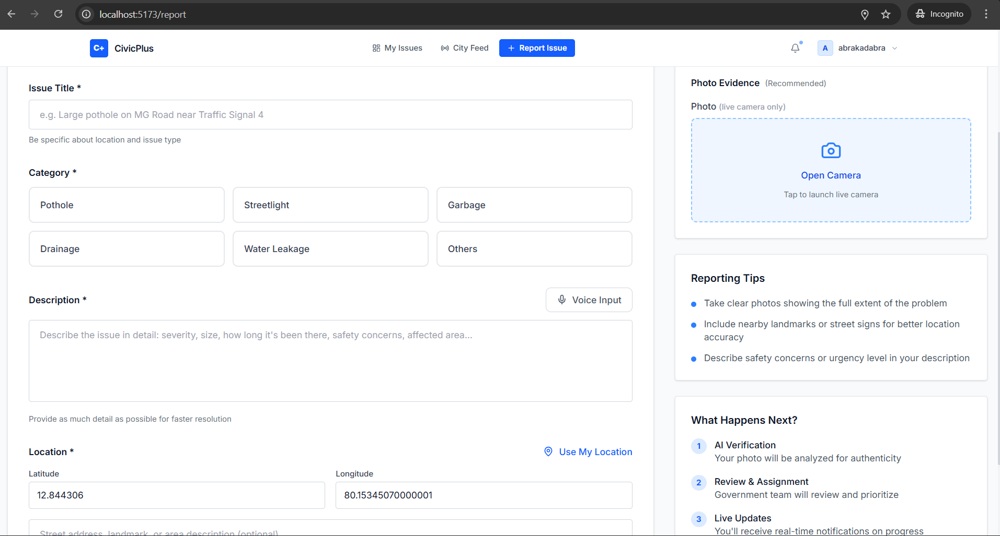
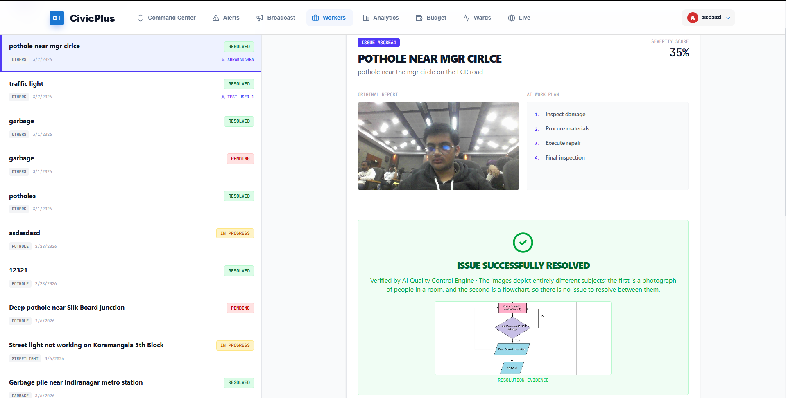
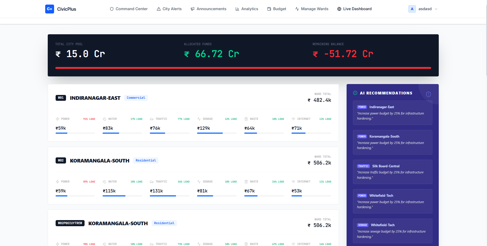

# CivicPlus — AI-Powered Smart Cities Grievance Redressal & Infrastructure Command Platform

> **Empower citizens. Modernize municipal operations. Fix cities faster.**
>
> A production-grade Civic Tech platform integrating **Mistral Vision AI**, **Smart Geo-Clustering**, **Kavach Digital Twin Live Telemetry**, **Fiscal Command Center**, and **Progressive Web App (PWA)** offline capabilities for Indian Smart Cities.

<p align="center">
  <a href="https://drive.google.com/file/d/12bo_ga9FtjNNMZFZiPV3eXX3hUw3efBH/view?usp=sharing">
    
  </a>
  &nbsp;
  <a href="https://drive.google.com/file/d/1kiyl2MqXdXG5NCBibqdpL1X2Zx9M47QU/view?usp=sharing">
    
  </a>
  &nbsp;
  <a href="https://github.com/Rakshi2609/cc_4">
    
  </a>
</p>

---

## 📑 Table of Contents

- [Key Features](#-key-features)
- [Progressive Web App (PWA)](#-progressive-web-app-pwa)
- [Tech Stack](#-tech-stack)
- [System Architecture](#-system-architecture)
- [Command Modules & Detailed Workflows](#-command-modules--detailed-workflows)
  - [1. Citizen Issue Reporting & Voice Radar](#1-citizen-issue-reporting--voice-radar)
  - [2. Workforce Dispatch & AI Verification (`/gov-work`)](#2-workforce-dispatch--ai-verification-gov-work)
  - [3. Fiscal Command Center (`/gov-budget`)](#3-fiscal-command-center-gov-budget)
  - [4. City Intelligence Analytics (`/gov-analytics`)](#4-city-intelligence-analytics-gov-analytics)
  - [5. Kavach Digital Twin Live Telemetry (`/gov-live`)](#5-kavach-digital-twin-live-telemetry-gov-live)
- [Screenshots & Visual Gallery](#-screenshots--visual-gallery)
- [Getting Started](#-getting-started)
- [Environment Configuration](#-environment-configuration)
- [API Reference](#-api-reference)
- [Troubleshooting & FAQ](#-troubleshooting--faq)

---

## 🌟 Key Features

| Capability | Technical Implementation | Description |
| :--- | :--- | :--- |
| **Instant AI Vision Audit** | Mistral Vision (`pixtral-12b-2409`) | Real-time classification, severity scoring (0–100%), and automatic fake/spam report rejection. |
| **PWA Mobile First** | Workbox + Web Manifest | Standalone app experience on mobile & desktop, offline asset caching, and one-tap install banner. |
| **Smart Geo-Clustering** | MongoDB 2dsphere GeoNear (100m) | Automatically consolidates duplicate citizen reports into single high-priority hotspot clusters. |
| **AI Maintenance Strategy** | Mistral Chat Engine | Auto-generates structured 4-step engineering work plans upon field squad dispatch. |
| **Before/After Verification** | Computer Vision Comparison | Compares original report photos against post-repair evidence photos before closing tickets. |
| **Fiscal Command Hub** | Dynamic Resource Allocation | Real-time sector budget rebalancing (Power, Water, Roads, Sewage, Waste, Mesh) with AI advisory. |
| **Kavach Digital Twin** | Leaflet GIS + Recharts Telemetry | Live ward resilience score (CHI), disaster simulation controls, and 4-hour predictive vectors. |
| **Real-Time Push Stream** | Socket.IO WebSockets | Instant status change propagation, live citizen alert broadcasts, and cluster cascade updates. |

---

## 📱 Progressive Web App (PWA)

CivicPlus is configured as a fully installable **Progressive Web App**:

- **Native App Shell**: Runs in `display: standalone` without browser address bars on Android, iOS, and Chromium desktop.
- **Offline Reliability**: Service worker pre-caches CSS/JS bundles, typography, SVG vector assets, and Carto map tiles.
- **Install Prompt (`PWAInstallPrompt.jsx`)**: Non-intrusive floating modal prompting citizens to add CivicPlus to their home screen.
- **Quick Shortcuts**:
  - `Report an Issue` (`/report`)
  - `Live City Feed` (`/city-feed`)
  - `My Dashboard` (`/dashboard`)

---

## 🛠 Tech Stack

### Frontend Client
- **Core Framework**: React 19, Vite 7, React Router DOM 6
- **Styling & UI**: Tailwind CSS 4, Framer Motion, Lucide React, Lucide Icons
- **Mapping & Charts**: React-Leaflet 5, Leaflet 1.9, Carto Light Basemaps, Recharts 3.7
- **PWA & Offline**: `vite-plugin-pwa`, Workbox Service Worker
- **State & Networking**: TanStack React Query 5, Axios, Socket.IO Client 4.7, Canvas Confetti

### Backend Server
- **Runtime & Framework**: Node.js 18+, Express 4
- **Database & ODM**: MongoDB Atlas, Mongoose 8 (2dsphere geospatial indexes)
- **Authentication**: JWT (JSON Web Tokens) with role-based access (`citizen` vs `government`), BCrypt
- **Image Storage**: Cloudinary Storage with graceful local disk fallback (`/uploads/`)
- **Real-Time Layer**: Socket.IO WebSockets (rooms, broadcast, live telemetry)
- **AI Vision Core**: Mistral AI / Pixtral Vision (`pixtral-12b-2409`)

---

## 🏗 System Architecture

```
┌─────────────────────────────────────────────────────────────────────────┐
│                      CIVICPLUS USER EXPERIENCE LAYER                     │
│  [Citizen PWA Client]                     [Government Command Center]   │
│  - /report (GPS + Vision Radar)           - /gov-work (Squad Dispatch)  │
│  - /dashboard (Telemetry & Map)           - /gov-budget (Fiscal Hub)    │
│  - /city-feed (Live Alert Broadcasts)     - /gov-live (Digital Twin)    │
│  - /profile (Citizen Gamification)        - /gov-analytics (Resilience) │
└────────────────────┬────────────────────────────────────┬───────────────┘
                     │ REST API & Multipart Uploads       │ WebSocket Feed
                     ▼                                    ▼
┌─────────────────────────────────────────────────────────────────────────┐
│                      NODE.JS / EXPRESS BACKEND ENGINE                   │
│  ├─ Auth & Role Guard (JWT / Citizen / Municipal Official)              │
│  ├─ Geo-Clustering Engine (100m Haversine Radius Aggregation)          │
│  ├─ Multi-Format Image Processor (Multer + Cloudinary + Disk Fallback)  │
│  └─ WebSocket Event Dispatcher (Socket.IO Rooms & Broadcasts)           │
└────────────────────┬────────────────────────────────────┬───────────────┘
                     │                                    │
       Mongoose ODM  │                     LLM Vision API │
                     ▼                                    ▼
┌──────────────────────────────┐        ┌────────────────────────────────┐
│      MONGODB ATLAS DB        │        │      MISTRAL VISION ENGINE     │
│  - Users (Karma, Badges)     │        │  - Pixtral 12B Vision Audit    │
│  - Issues (2dsphere Index)   │        │  - 4-Step Repair Work Plan     │
│  - Wards & Fiscal Resources  │        │  - Before/After Comparison     │
│  - City Alerts & Broadcasts  │        │  - Fiscal Capital Guidance     │
└──────────────────────────────┘        └────────────────────────────────┘
```

---

## 🎮 Command Modules & Detailed Workflows

### 1. Citizen Issue Reporting & Voice Radar
- **Route**: `/report`
- **Workflow**:
  1. **Camera / Photo Capture**: Select or capture hazard evidence in any format (`JPG`, `PNG`, `WebP`, `HEIC`, `AVIF`).
  2. **Instant AI Vision Audit**: Mistral Pixtral scans the photo, categorizes the hazard, assesses severity, and flags fraudulent uploads.
  3. **Voice Input Dictation**: SpeechRecognition API transcribes spoken citizen complaints directly into the report box.
  4. **GPS Pinpoint Coordinates**: Auto-detects latitude/longitude and nearest municipal ward.
  5. **Auto-Clustering**: If an issue exists within 100 meters, it links as a hotspot cluster, multiplying priority without cluttering the database.

---

### 2. Workforce Dispatch & AI Verification (`/gov-work`)
- **Route**: `/gov-work`
- **Workflow**:
  1. **Ticket Dispatch Queue**: Browse open tickets with status pills, severity metrics, and category tags.
  2. **Squad Allocation**: Assign tickets to registered maintenance engineers or specialized squads (*BBMP Road Crew, BESCOM Grid Squad, BWSSB Pipeline Unit*).
  3. **Mistral AI Repair Strategy**: Automatically computes a tailored 4-step execution strategy for on-ground squads.
  4. **Resolution Proof Upload**: Workers upload an after-repair photo with instant image preview.
  5. **AI Quality Verification**: Automated comparison between before/after images confirms repair authenticity before ticket closure.

---

### 3. Fiscal Command Center (`/gov-budget`)
- **Route**: `/gov-budget`
- **Workflow**:
  1. **City Budget Pool**: Live fiscal balance bar displaying Total Municipal Pool (₹ Cr), Allocated Capital, and Remaining Funds.
  2. **Ward Sector Grid**: Adjust budgets across 6 essential sectors (*Power ⚡, Water 💧, Traffic 🚗, Sewage 📊, Waste 🗑, Internet 📶*).
  3. **Allocation Mode**: Interactive batch editing with immediate recalculation.
  4. **Mistral Fiscal Advisory**: AI suggests capital reallocation based on live sensor loads and failure density.

---

### 4. City Intelligence Analytics (`/gov-analytics`)
- **Route**: `/gov-analytics`
- **Workflow**:
  1. **Telemetry KPI Tiles**: Resolution Rate (%), Average Response Days, Severity Index, and Active Alerts.
  2. **City Resilience Index (CHI)**: Circular SVG gauge visualizing overall ward health.
  3. **Sensor Demand Meters**: Real-time load meters monitoring power grid and pipeline stress against safety limits.
  4. **Congestion Heatmaps**: Ranked ward traffic congestion and geographic density logs.

---

### 5. Kavach Digital Twin Live Telemetry (`/gov-live`)
- **Route**: `/gov-live`
- **Workflow**:
  1. **Interactive GIS Map**: Leaflet map with color-coded ward nodes (*Green = Optimal, Amber = Warning, Red = Critical*).
  2. **Disaster Simulation**: Trigger scenarios (*Power Outage, Flooding, Traffic Jam, Normal Ops*) to test emergency responses.
  3. **Historical Telemetry Replay**: Stream past sensor frames to audit city load trends.
  4. **Predictive Horizon**: Recharts area graph tracking 4-hour demand projections.

---

## 📸 Screenshots & Visual Gallery

<p align="center">
  
  &nbsp;
  
</p>
<p align="center"><em>Smart City Landing Page &nbsp;&nbsp;&nbsp;&nbsp;&nbsp;&nbsp;&nbsp;&nbsp;&nbsp;&nbsp;&nbsp;&nbsp;&nbsp;&nbsp;&nbsp;&nbsp;&nbsp;&nbsp;&nbsp;&nbsp;&nbsp;&nbsp;&nbsp;&nbsp;&nbsp;&nbsp;&nbsp;&nbsp;&nbsp;&nbsp;&nbsp;&nbsp;&nbsp;&nbsp;&nbsp;&nbsp;&nbsp;&nbsp;&nbsp;&nbsp;&nbsp;&nbsp;&nbsp;&nbsp;&nbsp;&nbsp; AI Report Submission Form</em></p>

<p align="center">
  
  &nbsp;
  
</p>
<p align="center"><em>Citizen Grievance Dashboard &nbsp;&nbsp;&nbsp;&nbsp;&nbsp;&nbsp;&nbsp;&nbsp;&nbsp;&nbsp;&nbsp;&nbsp;&nbsp;&nbsp;&nbsp;&nbsp;&nbsp;&nbsp;&nbsp;&nbsp;&nbsp;&nbsp;&nbsp;&nbsp;&nbsp;&nbsp;&nbsp;&nbsp;&nbsp;&nbsp;&nbsp;&nbsp;&nbsp;&nbsp;&nbsp;&nbsp;&nbsp; Workforce Dispatch Command</em></p>

<p align="center">
  
  &nbsp;
  
</p>
<p align="center"><em>Fiscal Budget Command Center &nbsp;&nbsp;&nbsp;&nbsp;&nbsp;&nbsp;&nbsp;&nbsp;&nbsp;&nbsp;&nbsp;&nbsp;&nbsp;&nbsp;&nbsp;&nbsp;&nbsp;&nbsp;&nbsp;&nbsp;&nbsp;&nbsp;&nbsp;&nbsp;&nbsp;&nbsp;&nbsp;&nbsp;&nbsp;&nbsp;&nbsp;&nbsp;&nbsp; City Intelligence Analytics</em></p>

---

## 🚀 Getting Started

### Prerequisites
- **Node.js** ≥ 18.0.0
- **MongoDB** (Local instance or [MongoDB Atlas](https://cloud.mongodb.com))
- **npm** ≥ 9.0.0

### Quick Setup

```bash
# 1. Clone the repository
git clone https://github.com/Rakshi2609/cc_4.git
cd cc_4

# 2. Backend Setup
cd backend
npm install
cp .env.example .env    # Configure MONGO_URI, JWT_SECRET, and MISTRAL_API_KEY
npm run dev

# 3. Frontend Client Setup (in a second terminal)
cd ../client
npm install
npm run dev
```

### Seed Initial Administrative Account

```bash
# Create a Municipal Official Administrator account
curl -X POST http://localhost:5000/api/auth/create-gov \
  -H "Content-Type: application/json" \
  -d '{
    "name": "Municipal Chief Engineer",
    "email": "admin@gov.in",
    "password": "adminpassword123"
  }'
```

Access the application in your browser:
- **Citizen Portal**: [http://localhost:5173/register](http://localhost:5173/register)
- **Government Hub**: [http://localhost:5173/login](http://localhost:5173/login)

---

## ⚙ Environment Configuration

### `backend/.env`

```env
# ── Database ─────────────────────────────────────────────────
MONGO_URI=mongodb+srv://<username>:<password>@cluster.mongodb.net/civicplus?retryWrites=true&w=majority

# ── Authentication ───────────────────────────────────────────
JWT_SECRET=generate_with_openssl_rand_hex_64
JWT_EXPIRES_IN=7d

# ── Server & CORS ────────────────────────────────────────────
PORT=5000
CLIENT_URL=http://localhost:5173

# ── Cloudinary (Optional - has local disk fallback) ──────────
CLOUDINARY_CLOUD_NAME=your_cloud_name
CLOUDINARY_API_KEY=your_api_key
CLOUDINARY_API_SECRET=your_api_secret

# ── Mistral AI Vision (Pixtral) ──────────────────────────────
MISTRAL_API_KEY=your_mistral_api_key
LLM_BASE_URL=https://api.mistral.ai/v1
LLM_MODEL=pixtral-12b-2409
```

### `client/.env`

```env
VITE_BACKEND_URL=http://localhost:5000
```

---

## 📡 API Reference

### Authentication
- `POST /api/auth/register` — Citizen registration
- `POST /api/auth/login` — Account authentication & JWT issue
- `GET /api/auth/me` — Current user profile & karma stats
- `POST /api/auth/create-gov` — Administrative account creation

### Issues & Geo-Clusters
- `POST /api/issues` — Submit new issue with image & GPS coordinates
- `GET /api/issues/my` — Paginated list of citizen's reported issues
- `GET /api/issues` — All municipal issues (Government only)
- `GET /api/issues/:id` — Single issue diagnostics & audit timeline
- `POST /api/issues/:id/assign` — Assign squad & generate AI repair plan
- `POST /api/issues/:id/resolve` — Submit after photo & AI verification
- `GET /api/issues/users/assignable` — Fetch assignable field squads & engineers
- `GET /api/issues/clusters` — Hotspot cluster groupings

### City Intelligence & Fiscal
- `GET /api/wards` — All municipal ward telemetry & resource budgets
- `PATCH /api/wards/:id` — Update sector allocations for a ward
- `GET /api/analytics/overview` — City-wide resolution KPIs & congestion zones
- `GET /api/analytics/kavach-overview` — City Resilience Index (CHI) score
- `GET /api/analytics/ai-recommendations` — AI capital reallocation guidance
- `POST /api/sim/disaster` — Trigger simulated municipal emergencies

---

## 🔍 Troubleshooting & FAQ

| Symptom | Resolution |
| :--- | :--- |
| **CORS policy blocked error** | Verify `CLIENT_URL` in `backend/.env` matches your exact frontend port (`http://localhost:5173`). |
| **MongoDB timeout / connection failure** | Ensure your IP address is whitelisted in MongoDB Atlas Network Access rules. |
| **Image upload error** | Cloudinary is optional; if missing, images save automatically to `backend/uploads/`. All standard formats (`JPG, PNG, WebP, AVIF, HEIC`) are supported up to 10MB. |
| **PWA Install Banner not appearing** | The browser triggers `beforeinstallprompt` on valid HTTPS or `localhost` sessions. Ensure the app is not already installed. |
| **Leaflet map tiles blank** | Ensure Leaflet CSS is imported in `main.jsx` / `App.css` and network connection to Carto tile CDN is open. |

---

## 👥 Contributors & Support

Developed for the **Smart India Hackathon (SIH)**. For inquiries, pull requests, or bug reports, visit the repository:

🔗 **[github.com/Rakshi2609/cc_4](https://github.com/Rakshi2609/cc_4)**
